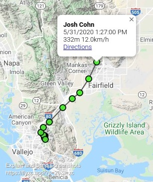

## FlyXC

- Visualize your flights,
- Plan your flights,
- Add your satellite trackers (inreach/spot) to the map

## Manual

Switch to full screen.

Display airspaces.

Display a heat map of the most flown routes.

Plan you next flights.
Drag the end/middle points on the route segments to update the route.
Right-click on the map to add a new point at the end of the route.

Display your tracks. Supports igc, gpx, and kml formats.
You can display multiples tracks on the same map.

Add your satellite tracker.

All registered pilot live tracks are automatically added to the map and fixes
persist for 24 hours. Recent fixes are bright green while older fixes turn gray
as time passes.

Note: The updates are pushed to the browser as they are ready. There is no need
to force refresh flyxc by reloading the page - this will never display fresher
data. 

Change preferences.

## Contributors

- [Momtchil Momtchev](https://github.com/mmomtchev),
- [Stanislav Ošmera](https://github.com/osmeras)

## Credits

- [ESRI](https://www.esri.com/) for their great [ArcGis API](https://developers.arcgis.com/javascript/) powering the 3D view, 
- [openaip.net](http://openaip.net/) for the airspaces,
- [thermal.kk7.ch](https://thermal.kk7.ch/) for the airways,
- [ionic](https://ionicframework.com/) for their neat UI components,
- [icons8](https://icons8.com/) for the [Line Awesome icons](https://github.com/icons8/line-awesome),
- [Tom Payne](https://github.com/twpayne) for sharing his airspace handling code and for the great XCPlanner that was a source of inspiration,
- bat icons made by [Freepik](https://www.flaticon.com/authors/freepik) - [www.flaticon.com](https://www.flaticon.com/),
- loader icon by [Sam Herbert](https://github.com/SamHerbert/SVG-Loaders/blob/master/svg-loaders/three-dots.svg),
- Angry Bird 3d model by [snootsy31](https://sketchfab.com/snootsy31),
- Santa 3d model by [MDALatam Studio dyn](https://sketchfab.com/minego90),
- Message 3d model by [bariacg](https://sketchfab.com/bariacg),
- the many open source libraries, projects, and data sources used by FlyXc.
