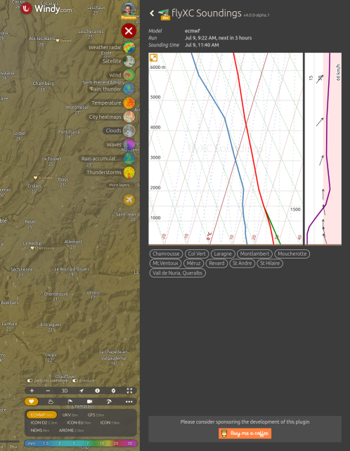
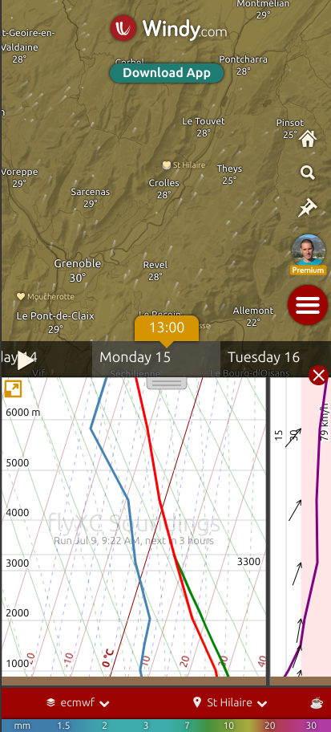
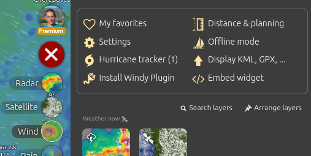
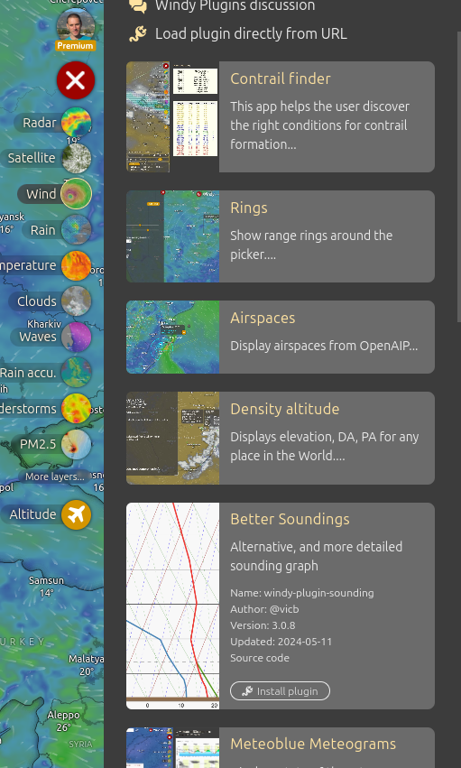
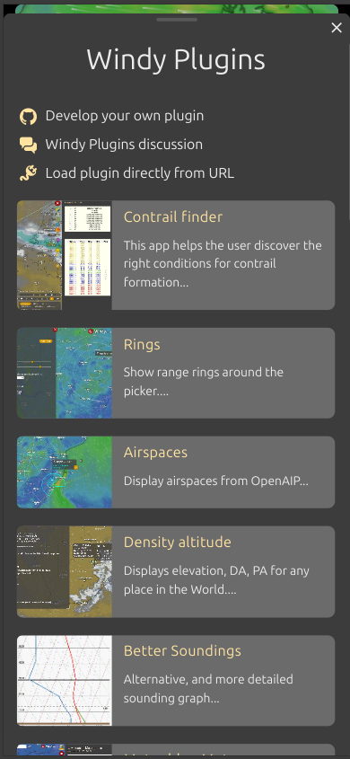
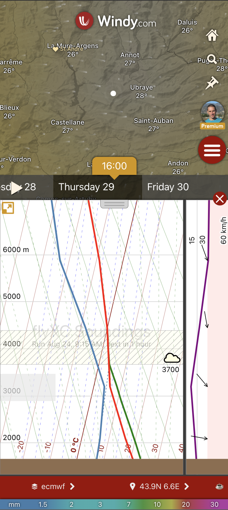

# flyXC soundings

The "flyXC soundings" plugin displays soundings customized for paraglider pilots on windy.com.

Sounding on a computer

Sounding on a mobile phone

## History

I learned to fly in 2002 in Albens, France near Annecy.

At the end of 2002 I moved to Nice and joined the paragliding club of Gréolières.
I was dreaming to fly XC, inspired by the flights of a talented pilot: Luc Armant.
Luc is not only a talented pilot, but he's very knowledgeable, humble, and loves to share.
He was mentoring pilots from the club and taught us about weather analysis, route planning, XC flying.

I remember when he introduced us to soundings. At that time we were using meteoblue and their model worked very well for the Alps. I was mind blown by how accurately soundings can help us predict the good days.
However, I was not impressed by the graph. Pilots are usually not fluent in hPa, wind barbs, and do not really care about what happens above 6000/7000m. I was thinking about extracting the sounding from the meteoblue image to display them in a form that would be more suited for us.

Fast-forward to 2015 when we moved to California. meteoblue was using the GFS model for the US, and it was not really matching the actual conditions. I found [windy.com](https://www.windy.com/) around 2018 and loved the site right away. I also loved the fact that it was possible to develop plugins having access to the forecast data.

John Kealy had already developed the "SkewT" plugin. I used his code source and help to develop the plugin sounding. It started as a proto for my own use. It was for me a chance to learn some weather theory and a new framework, PREACT. The plugin was released early 2019.

Over the years I have spent hundreds of hours to improve the plugin, keep up to date with preact changes and windy changes.

The codebase was not great, but the sounding was getting the job done. In summer 2024, I rewrote most of the plugin integrating the feedback from users and modernizing the code base.

I still have many ideas on how to improve the plugin. Many more ideas than free time. I will keep evolving the plugin if I can get some money from the users - you can sponsor the project via [buy me a coffee](https://buymeacoffee.com/vic.b).

## How to install the plugin on a computer

Open the menu (top-right) and click on "Install Windy Plugin"

Find the "flyXC Soundings" plugin and click on the "install" button

Installed plugins persist across visits so you only have to install them once per computer!

## How to install the plugin on a mobile phone

First open "<https://www.windy.com/plugins>" from **a browser** on your phone.

> [!IMPORTANT]
> Clicking on a link does not work, you have to type or copy paste the URL in a browser

Find the "flyXC Soundings" plugin and click on "Install" and "Open"

Once the plugin is installed on your phone, you can navigate to "<https://www.windy.com/plugin/sdg>" to open the plugin the next time (it's a good idea to bookmark the URL).

The windy team is working on improving the user experience on mobiles. They will also add plugin support in the native apps - you soon won't have to open windy.com in a browser to see the plugin.

## Updating the plugin

Windy plugins do not auto-update for now.

You have to manually delete the plugin and re-install it to update to the latest available version.

## Notes

- On desktop, you can scroll (mouse wheel) on the sounding diagram to go forward/backward in time - (pressing ctrl or shift will jump to the next/previous day),
- On touch devices, swiping left or right on the plugin will go backward or forward in time,
- The blue line shows the dewpoint,
- The red line shows air temperature,
- The green line shows the temperature of an ascending parcel,
- The hatched area across the graph shows the convective layer (cumulus clouds),
- The left area shows clouds (excluding cumulus),
- The top-most area show upper level clouds (i.e. up to ~15km),
- The wind graph shows wind from 0-30km/h in the left part (white background) and from 30 to max speed in right part (red background),
- On desktop, the subtitle shows which model is used ("GFS" in this example - note that not all models are supported),
- The axis units match your windy settings.

## Credits

- [windy.com](https://www.windy.com) for their great web app and exposing the required data,
- [windy-plugin-skewt](https://github.com/johnckealy/windy-plugin-skewt) by [by John C. Kealy](https://github.com/johnckealy) for some initial inspiration,
- [MetPy](https://unidata.github.io/MetPy) for the maths,
- [Preact](https://preactjs.com/) for the small footprint framework,
- Icons by [Yannick](https://www.flaticon.com/authors/yannick),
- [Loading Indicator](https://github.com/SamHerbert/SVG-Loaders) by Sam Herbert,
- and also [d3](https://d3js.org/), [Babel](https://babeljs.io/), [ESLint](https://eslint.org/), [SVGOMG](https://jakearchibald.github.io/svgomg/), ...

## Contributors

- [John Mark](https://github.com/johnmarkredding)
- Mark Millar

## Support the development

You can support the development of this plugin via the Buy me a Coffee platform

Any contribution is greatly appreciated!
