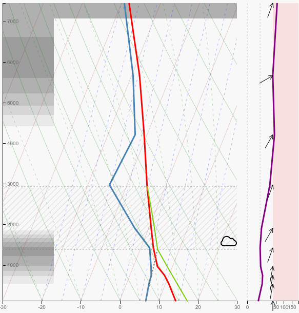

# windy-plugin-sounding

The "flyXC soundings" plugin displays soundings customized for paraglider pilots on windy.com.

## How to install the plugin on a computer

Open the menu (top-right) and click on "Install Windy Plugin"

Find the "flyXC Soundings" plugin and click on the "install" button

Installed plugins persist across visits so you only have to install them once per computer!

## How to install the plugin on a mobile phone

First open "https://www.windy.com/plugins" from **a browser** on your phone.

**Clicking on a link does not work, you have to type or copy paste the URL in a browser**

Find the "flyXC Soundings" plugin and click on "Install" and "Open"

Once the plugin is installed on your phone you can navigate to "https://www.windy.com/plugin/sdg" to open the plugin the next time (it's a good idea to bookmark the URL).

The windy team is working on improving the user experience on mobiles. They will also add plugin support in the native apps - you soon won't have to open windy.com in a browser to see the plugin.

## Updating the plugin

Windy plugins do not auto-update for now.

You have to manually delete the plugin and re-install it to update to the latest available version.

## Notes:

- On desktop, you can scroll (mouse wheel) on the sounding diagram to go forward/backward in time - (pressing ctrl or shift will jump to the next/previous day),
- On touch devices, swiping left or right on the plugin will go backward or forward in time,
- The blue line shows the dewpoint,
- The red line shows air temperature,
- The green line shows the temperature of an ascending parcel,
- The hatched area across the graph shows the convective layer (cumulus clouds),
- The left area shows clouds (excluding cumulus),
- The top-most area show upper level clouds (i.e. up to ~15km),
- The wind graph shows wind from 0-30km/h in the left part (white background) and from 30 to max speed in right part (red background),
- On desktop, the subtitle shows which model is used ("GFS" in this example - note that not all models are supported),
- The axis units match your windy settings.

## Credits:

- [windy.com](https://www.windy.com) for their great web app and exposing the required data,
- [windy-plugin-skewt](https://github.com/johnckealy/windy-plugin-skewt) by [by John C. Kealy](https://github.com/johnckealy) for some initial inspiration,
- [MetPy](https://unidata.github.io/MetPy) for the maths,
- [Preact](https://preactjs.com/) for the small footprint framework,
- Icons by [Yannick](https://www.flaticon.com/authors/yannick),
- [Loading Indicator](https://github.com/SamHerbert/SVG-Loaders) by Sam Herbert,
- and also [d3](https://d3js.org/), [Babel](https://babeljs.io/), [ESLint](https://eslint.org/), [SVGOMG](https://jakearchibald.github.io/svgomg/), ...

## Contributors

- [John Mark](https://github.com/johnmarkredding)

## Support the development

You can support the development of this plugin via the Buy me a Coffee platform

Any contribution is greatly appreciated!
